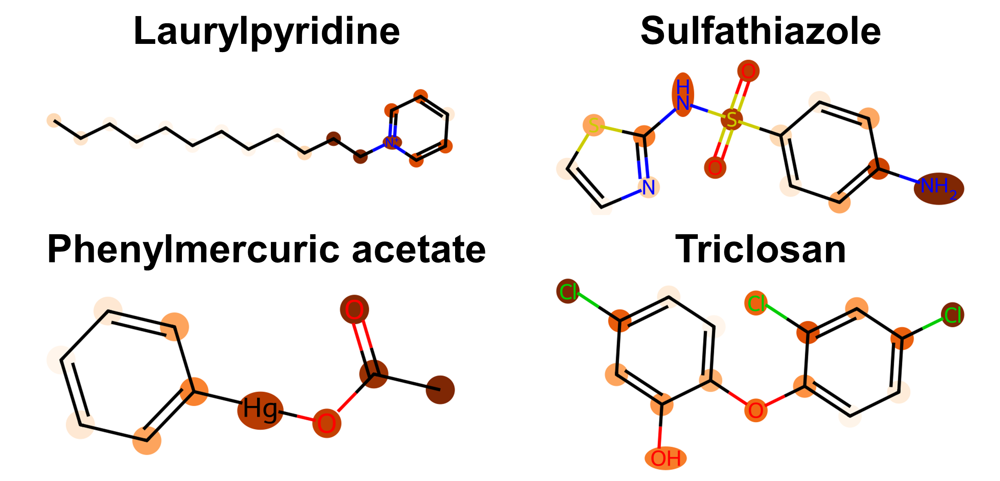

# Occurrence and Distribution of Antibacterial Quaternary Ammonium Compounds in Chinese Estuaries Revealed by Machine Learning-Assisted Mass Spectrometric Analysis
[](https://doi.org/10.1021/acs.est.4c02380)
<p align="left">


</p>

This repository provides the code for machine learning models predicting the antibacterial activity of chemicals and all associated raw datasets. Two graph-based ML models (i.e., [Graph Attention Network (GAT)](https://github.com/WestonSu/Antimicrobials/blob/main/1_GAT/code/Antibacterials.ipynb) and [Directed Message Passing Neural Networks (D-MPNN)](https://github.com/WestonSu/Antimicrobials/blob/main/2_DMPNN/DMPNN.ipynb)) and a descriptor-based model (i.e., [eXtreme Gradient Boosting (XGBoost)](https://github.com/WestonSu/Antimicrobials/blob/main/3_XGBoost/XGBoost.ipynb)) were selected to compare the predictive performance of different model architectures. **Ultimately, the [GAT](https://github.com/WestonSu/Antimicrobials/blob/main/1_GAT/code/Antibacterials.ipynb) model performed best** across five random splits of the dataset.

The [MIC_Pictures](https://github.com/WestonSu/Antimicrobials/tree/main/5_MIC_Pictures) folder contains the results of growth inhibition assays on _Escherichia coli_ (_E. coli_) for quaternary ammonium compounds (QACs). Detailed information about the compounds can be found in the manuscript.


---

## 📖 Table of Contents
- [🔧 Install & setup](#setup)
- [🚀 Quick start](#quickstart)
- [⚙️ Model interpretation](#interpretation)
- [📦 Model outputs](#outputs)
- [🤝 Collaboration](#Collaboration)
- [📄 Citations](#citations)
---

## 🔧 Install & setup <a name="setup"></a>
1. Clone the Antimicrobials repository:
```sh
git clone ://github.com/WestonSu/Antimicrobials
```
2. Change to the project directory:
```sh
cd Antimicrobials
```
3. Please ensure you have the following dependencies installed on your system:
- **Base Environment**:  
miniconda3:4.5.11-python3.7-cuda9.2-cudnn7-ubuntu18.04
- **Packages**:
    ```
    cudatoolkit: 10.0.130
    pytorch: 1.0.1
    rdkit: 2019.03.1.0
    seaborn: 0.9.0
    torchvision: 0.2.2
    matplotlib==3.0.3
    pyGPGO==0.4.0.dev1
    tensorboardX==1.6
    ```
 4. It is recommended to use Google Colaboratory, where you will avoid the hassle of installing complex dependencies. You only need to install **condacolab** and **rdkit**, and the installation will be completed within a few minutes.
   
## 🚀 Quick start <a name="quickstart"></a>

<details open><summary>Graph Attention Network (GAT)</summary>

| Function   | Description   |
|:------ |:--------- |                     
| [Antibacterials.ipynb](https://github.com/WestonSu/Antimicrobials/blob/main/1_GAT/code/Antibacterials.ipynb)                                 | The results for model training, evaluation, and prediction using GAT can be step-by-step reproduced by running 'Antibacterials.ipynb'. If all dependencies are correctly installed, then training a model with a Tesla V100-SXM2 should take about one hour.|                                            
| [AttentiveLayers.py](https://github.com/WestonSu/Antimicrobials/blob/main/1_GAT/code/AttentiveFP/AttentiveLayers.py)                         | Define the deep learning model for recognizing chemical fingerprints. |
| [Featurizer.py](https://github.com/WestonSu/Antimicrobials/blob/main/1_GAT/code/AttentiveFP/Featurizer.py)                                   | Extract features of chemical molecules to serve as inputs for the deep learning model. |
| [getFeatures.py](https://github.com/WestonSu/Antimicrobials/blob/main/1_GAT/code/AttentiveFP/getFeatures.py)                                 | Extract features from SMILES strings of chemical molecules, transforming them into model inputs. |
| [hyper_parameter_search.py](https://github.com/WestonSu/Antimicrobials/blob/main/1_GAT/code/hyper_parameter_search.py)                       | Search for the optimal model hyperparameters. |

</details>

<details open><summary>Directed Message Passing Neural Networks (D-MPNN)</summary>

| Function   | Description   |
|:------ |:--------- |      
| [DMPNN.ipynb](https://github.com/WestonSu/Antimicrobials/blob/main/2_DMPNN/DMPNN.ipynb) | The results for model training, evaluation, and prediction using DMPNN can be step-by-step reproduced by running 'DMPNN.ipynb'. |

</details>

<details open><summary>eXtreme Gradient Boosting (XGBoost)</summary>

| Function   | Description   |
|:------ |:--------- |      
| [XGBoost.ipynb](https://github.com/WestonSu/Antimicrobials/blob/main/3_XGBoost/XGBoost.ipynb) | The results for model training, evaluation, and prediction using XGBoost can be step-by-step reproduced by running 'XGBoost.ipynb'. |
| [Anti.txt](https://github.com/WestonSu/Antimicrobials/blob/main/3_XGBoost/Anti.txt)           | SMILES of compounds in the training set (n=2,928). |
| [Anti_MD.txt](https://github.com/WestonSu/Antimicrobials/blob/main/3_XGBoost/Anti_MD.txt)     | Molecular descriptors for compounds in the training set. |

</details>

<details open><summary>K-Nearest Neighbors (KNN): Model’s applicability domain</summary>

| Function   | Description   |
|:------ |:--------- |      
| [Applicability_Domain.ipynb](https://github.com/WestonSu/Antimicrobials/blob/main/4_Applicability_Domain/Applicability_Domain.ipynb) | Define the model’s applicability domain using the k-nearest neighbors variable selection method. The file contains SMILES representations for 50 structurally diverse antibacterial QACs that have been identified through mass spectrometric analysis, along with information about whether they fall within the model's applicability domain. |

</details>

---


---

## ⚙️ Model interpretation <a name="interpretation"></a>

The model outputs of **GAT**, D-MPNN, and XGBoost were explained using attention weight, substructure and SHapley Additive exPlanations ([SHAP](https://github.com/shap/shap)) approach. For detailed interpretation of the D-MPNN model results, please refer to [Chemprop](https://chemprop.readthedocs.io/en/latest/tutorial.html) GitHub project. In the GAT model, **attention weights** are introduced to weight the importance of nodes in molecular graphs, enabling the model to highlight crucial nodes and relationships for predictive tasks, thereby enhancing model interpretability. **For example, molecular features that contribute to the prediction of antibacterial activity are highlighted with deeper colors in the following figure.**



---

## 📦 Model outputs <a name="outputs"></a>

[Four_inventories_predict.csv](https://github.com/WestonSu/Antimicrobials/blob/main/1_GAT/code/Four_inventories_predict.csv): This file contains the GAT model predictions for antibacterial activity of 92,946 chemicals collected from the industrial chemical inventories of China, the United States, Canada, and the European Union. Details about the QACs predicted as positive [(n=856)](https://github.com/WestonSu/Antimicrobials/blob/main/Figure%20S21/bokeh_plot_clusters.png) from the combined industrial chemical database are provided in the Supporting Information of the manuscript.

[DssTox_predict.csv](https://github.com/WestonSu/Antimicrobials/blob/main/1_GAT/code/DssTox_predict.csv): This file contains the GAT model predictions for antibacterial activity of 791,623 chemicals from the [DSSTox database](https://epa.figshare.com/articles/dataset/DSSTox_v2000/8068211). Details about the QACs predicted as positive (n=3,851) within the DSSTox database can be found in the Supporting Information of the manuscript.


---

## 🤝 Collaboration <a name="Collaboration"></a>

Due to the limitations of the [training set (n=2,928)](https://github.com/WestonSu/Antimicrobials/blob/main/1_GAT/data/Anti_plus_v2.csv), certain chemicals outside its applicability domain may not have ideal predictions for antibacterial activity. We welcome contributions from other researchers to supplement data on the growth inhibition of _E. coli_ by other chemicals.

---

## 📄 Citations <a name="citations"></a>  

We ask users to directly cite the following paper:

Su, W. et al. Occurrence and Distribution of Antibacterial Quaternary Ammonium Compounds in Chinese Estuaries Revealed by Machine Learning-Assisted Mass Spectrometric Analysis. Environ. Sci. Technol. 2024, DOI: 10.1021/acs.est.4c02380

This project also builds on a number of other projects, algorithms and ideas. Please consider citing the following full list of papers when relevant: 

1. Stokes, J. M. et al. A deep learning approach to antibiotic discovery. Cell 180, 688–702.e613 (2020).
2. Yang, K. et al. Analyzing learned molecular representations for property prediction. J. Chem. Inf. Model. 59, 3370–3388 (2019).
3. Veličković, P. et al. Graph attention networks. Preprint at https://arxiv.org/abs/1710.10903 (2017).
4. Xiong, Z. et al. Pushing the boundaries of molecular representation for drug discovery with the graph attention mechanism. J. Med. Chem. 63, 8749–8760 (2020).
5. Chen, T. & Guestrin, C. XGBoost: a scalable tree boosting system. In Proc. 22nd ACM SIGKDD International Conference on Knowledge Discovery and Data Mining. 785–794 (Association for Computing Machinery, 2016)
6. Lundberg, S. M. et al. From local explanations to global understanding with explainable AI for trees. Nat. Mach. Intell. 2, 56–67 (2020).


